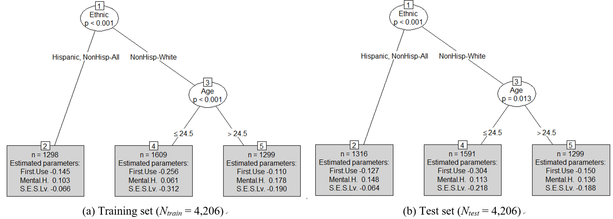

MOBofERA
====================================================

Here we provide some results on model-based recursive partitioning of extended redundancy analysis with an application to nicotine dependence among US adults

Authors
-------

- **Sunmee Kim** - <sunmee.kim@mail.mcgill.ca>
- **Heungsun Hwang** - <heungsun.hwang@mcgill.ca>
- Visit us at [Quantitative Methods Lab](https://sites.google.com/view/hwanglab)!

About ERA
----------

Extended redundancy analysis (ERA) is a statistical method that relates multiple sets of predictors to response variables. In ERA, a component is extracted from each set of predictor variables in such a way that it accounts for the maximum variation of a response variable. In this regard, ERA aims to perform data reduction and linear regression simultaneously, providing a simpler description of directional relationships among many sets of variables. 

About MOB
----------

Model-based recursive partitioning (MOB; Zeileis, Hothorn, & Hornik, 2008) aims to fit a specified statistical model to each of heterogeneous subgroups identified successively based on an additional set of covariates. 

About MOB of ERA
----------

We propose to combine ERA with model-based recursive partitioning in a unified framework so as to investigate whether the effects of components on a response variable are different across covariate-dependent subgroups. The proposed method, called MOB-ERA hereinafter, begins by fitting an ERA model to entire observations, producing a single set of the ERA parameter estimates, and then successively inspects whether there are substantial changes in the effects of components on the response variable across covariate-dependent subgroups.

Example: MOB-ERA for the 2012 NSDUH data. The MOB-ERA trees obtained from (a) the training set and (b) the test set. Node numbers are given at the top of every internal (circle) and terminal (grey box) node. Each internal node corresponds to the selected partitioning covariate and its p-value obtained from the parameter instability test. Each terminal node represents an identified subgroup and provides the number of observations and regression coefficient estimates for the subgroup.
